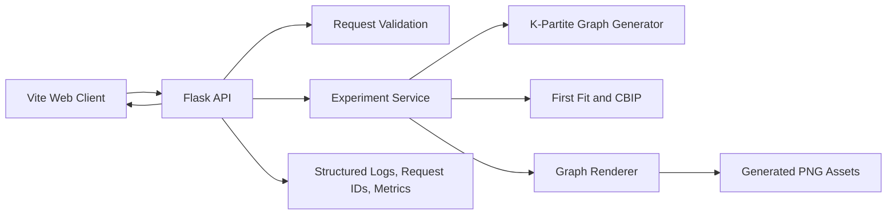
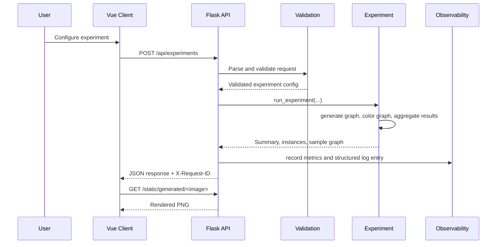

# Online Graph Coloring Analysis

One-line summary: a full-stack workbench for generating k-partite graphs, running online coloring algorithms, and comparing their efficiency through reproducible metrics and visualization.

Why it matters:

- online graph coloring shows up anywhere decisions must be made without full future knowledge
- the problem connects to scheduling, resource allocation, and conflict minimization
- comparing algorithms fairly requires reproducible graph generation, consistent metrics, and clear constraints

What makes it technically hard:

- online algorithms must color vertices without seeing the complete graph
- benchmark results are only useful if graph generation, seeding, and reporting are consistent
- the system has to combine algorithm logic, experiment orchestration, API delivery, and visualization without mixing concerns

## Key Features

- Random k-partite graph generation with configurable graph size, density, and seed.
- Multiple coloring strategies, including First Fit and CBIP.
- Aggregated experiment metrics plus per-instance output and rendered sample graphs.
- Structured request logging, request IDs, in-memory metrics, and environment-driven configuration.
- Backend integration tests and a benchmark script for repeatable runs.

## Stack

| Layer | Technology |
| --- | --- |
| Frontend | Vue 3, Vue Router, Vite, Axios |
| Backend | Flask, Flask-CORS |
| Algorithms & Visualization | Python, NetworkX, Matplotlib |
| Tooling | ESLint, Pytest, PowerShell startup script |

## System At A Glance



## Demo Flow

1. Start the project with `.\start-project.ps1` or run the backend and frontend manually.
2. Open `http://localhost:8080` and use the default experiment configuration.
3. Submit an experiment from the workbench and review:
   per-run results, average ratio, runtime, and the rendered sample graph.
4. Use `examples/demo-request.json` or `POST /api/experiments` directly to reproduce the same run through the API.

## Results Snapshot

The benchmark table below was generated on March 22, 2026 using:

- fixed seed `42`
- `20` instances per scenario
- `python backend/benchmark.py`

| Scenario | Avg colors | Avg ratio | Avg runtime (ms) | Best ratio | Worst ratio |
| --- | ---: | ---: | ---: | ---: | ---: |
| CBIP on bipartite graphs | 3.1 | 1.55 | 0.6113 | 1.0 | 2.0 |
| First Fit on bipartite graphs | 3.35 | 1.675 | 0.0341 | 1.0 | 3.0 |
| First Fit on 3-partite graphs | 5.25 | 1.75 | 0.023 | 1.3333 | 2.0 |
| First Fit on 4-partite graphs | 6.7 | 1.675 | 0.0321 | 1.5 | 2.0 |

Key takeaways:

- CBIP uses fewer colors than First Fit on the same bipartite workload.
- First Fit is substantially faster because it applies a simpler greedy rule.
- On higher-partite graph families, First Fit stays fast but continues to exceed the target chromatic number.

## Architecture

### Backend

`backend/graph_coloring/`

- `api.py`: Flask app factory, routing, request timing, request IDs, and API-level metrics.
- `config.py`: environment-driven backend configuration.
- `validation.py`: request parsing and domain constraints.
- `generator.py`: k-partite graph generation.
- `algorithms.py`: First Fit and CBIP implementations.
- `experiment.py`: experiment execution and metric aggregation.
- `visualization.py`: graph rendering.
- `logging_utils.py`: structured JSON logging.
- `metrics.py`: in-memory operational counters.
- `models.py`: experiment result models.

### Frontend

`frontend/src/`

- `components/LandingPage.vue`: product overview.
- `components/GraphColoring.vue`: experiment workbench and result display.
- `router/index.js`: route setup.
- `config.js`: frontend API configuration.
- `assets/styles.css`: application styles.

### Request Flow



## Production Signals

The project includes several lightweight production-oriented capabilities:

- Structured JSON logs for request completion and unexpected failures.
- Request ID propagation through the `X-Request-ID` response header.
- In-memory metrics exposed at `GET /api/metrics`.
- Environment-driven backend configuration through `.env.example`.
- Graceful shutdown hooks for `SIGINT` and `SIGTERM`.
- Backend integration tests through the Flask test client.

## Design Decisions

- The API returns both aggregated summaries and per-instance results so the frontend can support quick overview and detailed inspection from the same payload.
- CBIP requests are restricted to bipartite graph families at validation time because the algorithm is not defined for general k-partite inputs.
- Observability is intentionally lightweight: metrics are kept in memory and logs are written to standard output to keep local development simple.
- The frontend stays thin and treats the backend as the source of truth for experiment rules and result formatting.

## Failure Handling

- Invalid experiment configurations return `400` responses with a validation error and request ID.
- Unexpected backend exceptions are logged with structured context and return a JSON `500` response.
- Request-level metrics track total requests, errors, and experiment counts by method.
- The backend handles shutdown signals so local runs exit predictably.

## Tradeoffs

- In-memory metrics are easy to operate locally but are not durable across restarts.
- Matplotlib image rendering makes experiments easier to inspect, but it adds filesystem output and some overhead.
- Flask keeps the backend small and approachable, but it is not the best fit for high-throughput asynchronous workloads.
- First Fit offers speed and simplicity, while CBIP offers better color efficiency on bipartite workloads at a higher runtime cost.

## Running Locally

### One-command startup

```powershell
.\start-project.ps1
```

This script:

- creates `.venv` if needed
- copies `.env.example` to `.env` when missing
- installs backend dependencies
- installs frontend dependencies
- copies `frontend/.env.example` to `frontend/.env.local` when missing
- starts the frontend in a new PowerShell window
- starts the backend in the current window

### Manual startup

#### Backend

```powershell
python -m venv .venv
.\.venv\Scripts\python.exe -m pip install -r requirements-dev.txt
.\.venv\Scripts\python.exe backend/app.py
```

Backend URL:

- `http://localhost:5000`

#### Frontend

```powershell
cd frontend
npm install
Copy-Item .env.example .env.local
npm run dev
cd ..
```

Frontend URL:

- `http://localhost:8080`

## Environment Configuration

Backend example: `.env.example`

```env
APP_HOST=127.0.0.1
APP_PORT=5000
APP_DEBUG=true
APP_LOG_LEVEL=INFO
APP_CORS_ORIGINS=http://localhost:8080
APP_REQUEST_ID_HEADER=X-Request-ID
```

The backend automatically loads `.env` from the repository root if the file is present.

Frontend example: `frontend/.env.example`

```env
VITE_API_BASE_URL=http://localhost:5000
```

## API

### Health Check

`GET /api/health`

```json
{
  "status": "ok",
  "requestId": "..."
}
```

### Metrics

`GET /api/metrics`

Example shape:

```json
{
  "requests": {
    "total": 12,
    "errors": 1,
    "averageDurationMs": 8.4213,
    "byPath": {
      "/api/health": 3,
      "/api/experiments": 8,
      "/api/metrics": 1
    }
  },
  "experiments": {
    "total": 8,
    "averageRatio": 1.66,
    "byMethod": {
      "first_fit": 6,
      "cbip": 2
    }
  }
}
```

### Run An Experiment

`POST /api/experiments`

Sample request:

```json
{
  "chromaticNumber": 3,
  "numberOfVertices": 24,
  "numberOfInstances": 8,
  "coloringMethod": "first_fit",
  "edgeProbability": 0.35,
  "seed": 42
}
```

Sample request file:

- `examples/demo-request.json`

Response shape:

```json
{
  "request": {
    "chromatic_number": 3,
    "number_of_vertices": 24,
    "number_of_instances": 8,
    "coloring_method": "first_fit",
    "edge_probability": 0.35,
    "seed": 42
  },
  "summary": {
    "average_colors_used": 5.0,
    "average_ratio": 1.6667,
    "average_runtime_ms": 0.03,
    "best_ratio": 1.3333,
    "worst_ratio": 2.0,
    "valid_colorings": true
  },
  "instances": [
    {
      "instance": 1,
      "seed": 42,
      "colors_used": 5,
      "ratio": 1.6667,
      "runtime_ms": 0.03
    }
  ],
  "sample_graph": {
    "image": "graph_xxxxx.png",
    "imageUrl": "/static/generated/graph_xxxxx.png",
    "seed": 42,
    "vertexCount": 24,
    "edgeCount": 76
  }
}
```

## Verification

The following checks were executed successfully on March 22, 2026:

- `python -m pytest backend/tests -q`
- `npm run lint`
- `npm run build`
- `npm audit --omit=dev`
- `python backend/benchmark.py`

Current backend test result:

- `8 passed`

## Repo Structure

```text
.
|-- backend/
|   |-- app.py
|   |-- benchmark.py
|   |-- graph_coloring/
|   |-- static/generated/
|   `-- tests/
|-- examples/
|   `-- demo-request.json
|-- frontend/
|   |-- public/
|   |-- src/
|   `-- .env.example
|-- .env.example
|-- requirements.txt
|-- requirements-dev.txt
|-- start-project.ps1
`-- README.md
```

## Limitations

- Metrics are in-memory only and reset when the process restarts.
- The backend has no authentication or multi-user isolation.
- Generated graph images are written to local disk rather than an object store.
- The benchmark suite is focused on representative scenarios, not exhaustive large-scale workloads.

## Future Improvements

- Export metrics to a persistent backend such as Prometheus or OpenTelemetry.
- Add authenticated multi-user experiment history and saved runs.
- Move generated image storage behind a configurable storage interface.
- Introduce queued background execution for larger experiments.
- Expand benchmark coverage with larger graph families and algorithm variants.
